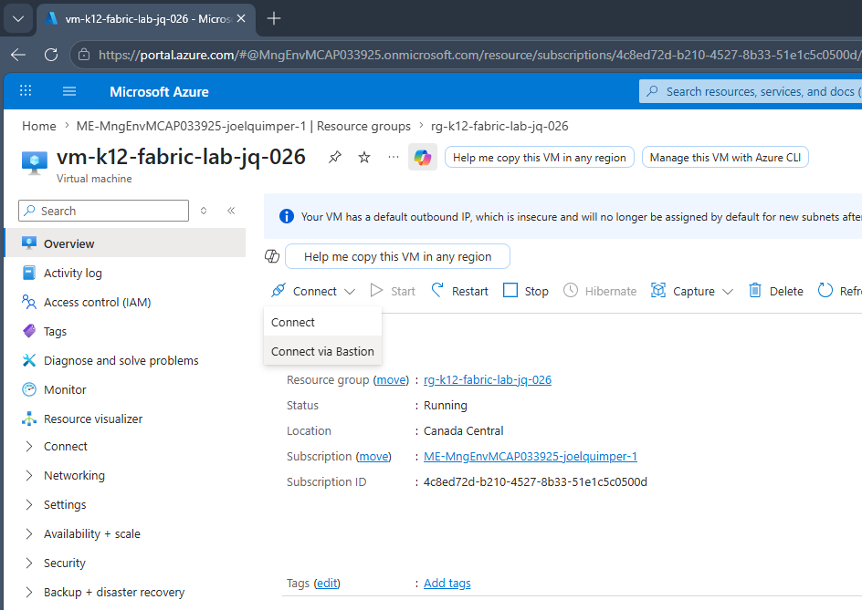
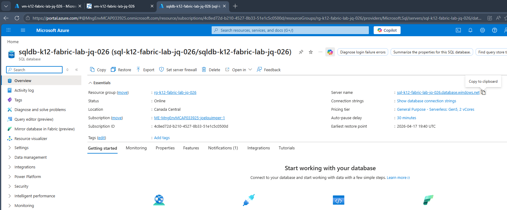
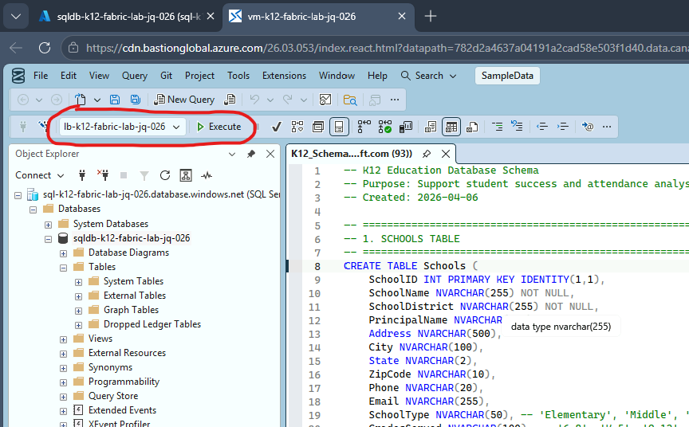

# K12 Education Database Lab for Fabric

Sample K12 education database for Fabric end-to-end lab environment.

## Files Overview

**infra/** - Azure infrastructure as code (Bicep, deploy script, and deployment guide). See `infra/DEPLOYMENT.md` for full setup instructions.

**SampleData/GenerationTool/** - Python scripts for generating sample data and verifying consistency patterns.

**K12_Schema.sql** - Creates 10 tables: Schools, Teachers, GradeLevels, Classes, Students, Enrollment, Attendance, GradeAssessments, StudentSuccessMetrics, StudentInterventions.

**K12_BulkInsert.sql** - Loads CSV data into all tables with verification query.

**DATA_DICTIONARY.md** - Complete schema documentation.

## Quick Start

### Step 1: Deploy Infrastructure
Set up Azure resources (SQL Database, VM, networking). See `infra/DEPLOYMENT.md` for detailed steps. The deployment takes 10-15 minutes and creates all required resources. 

### Step 2: Connect in the VM
In the Azure Portal, navigate to the VM that was created during the deployment and connect using bastion.



### Step 2: Create Database Schema
In the Azure Portal, navigate to the database. Copy the server name.


Once in the VM, start SSMS. If prompt to login, just skip it. Once in SSMS, connect to the database using the copied server name.  Select Entra MFA for authentication and use your Entra Id account to connect.

In SSMS, open the `K12_Schema.sql` file.  It is located in `C:\Repos\presentations-and-labs\Labs\Fabric\Database`

Run `K12_Schema.sql` in SSMS against your SQL Database.  Make sure you selected your database and not `master`.


### Step 3: Load Data
Run `K12_BulkInsert.sql` in SSMS to load all CSV files from `SampleData/`. The script includes a verification query showing expected record counts.

## Data Model

| Entity | Count |
|--------|-------|
| Schools | 20 |
| Teachers | 406 |
| Classes | 423 |
| Students | 8,356 |
| Enrollments | 51,624 |
| Attendance Records | 5,040,035 |
| Assessments | 1,031,326 |
| Success Metrics | 103,248 |
| Interventions | 2,518 |

## Important Notes

All data is synthetic and anonymous. Names are randomly generated. Indexes are created on key columns for performance. Large transaction tables (Attendance and GradeAssessments) are split by SchoolID across 20 files to keep individual files under 50MB. 

**Realistic Patterns:** Each student has consistent performance and attendance characteristics throughout the dataset:
- Performance levels drive grade distribution across all classes (high performers consistently earn A/B grades)
- Attendance propensity **correlates with performance**: High performers (75+) average 88% attendance; low performers (<50) average 74% attendance
- Day-of-week absence patterns (some students miss more Fridays, others miss more Mondays)
- Interventions are scaled to difficulty: High-difficulty students (low grades + low attendance) receive 2-4 interventions vs. 0-1 for low-difficulty students
- All metrics are correlated: low attendance often correlates with lower grades, which triggers more intensive interventions

## Data Customizations

### Generate Your Own Data

If you want to generate different data or additional records:

```bash
cd SampleData/GenerationTool
pip install pandas
python generate_sample_data.py
```

This creates files in the `SampleData/` folder with 48 total files:
- **Base tables** (8 files): Schools, Teachers, Students, GradeLevels, Classes, Enrollment, StudentSuccessMetrics, StudentInterventions
- **Split by school** (40 files): Attendance_School_1.csv through Attendance_School_20.csv, GradeAssessments_School_1.csv through GradeAssessments_School_20.csv
  - Splitting keeps large transaction tables under 50MB each (Attendance files: 6.67-13.40 MB, GradeAssessments files: 2.71-5.30 MB)

### Per-Student Consistency

The data generator creates realistic per-student patterns across all metrics:

- **Performance Level (0-100)** - Each student gets a baseline ability that influences ALL grades consistently. High performers score 85-95% in every class; struggling students score 40-60%.
- **Attendance Propensity** - Each student has a personal attendance pattern that **correlates with performance**: High performers (75+) have 75% chance of good attendance; low performers (<50) have only 20% chance.
- **Day-of-Week Patterns** - Individual students show patterns (Fridays have higher absence rates for some, Mondays for others).
- **Data-Driven Interventions** - Interventions are targeted to students with actual low grades or attendance, NOT random. More difficult students get MORE interventions (2-4 vs 1-2). Intervention type matches need (ELL support for ELL, special ed for special ed, tutoring for academic struggle, counseling for attendance/behavioral issues).
- **Correlated Metrics** - Low attendance correlates with lower grades; both trigger interventions; overall success metrics reflect real performance. The data tells a coherent story. You can identify which students are struggling, why (performance vs. attendance), and what interventions are being used.

### Customization Options

```python
# Adjust scale
generator.generate_students(num_schools=5, students_per_school=500)

# Modify seed for different randomization
generator = K12DataGenerator(seed=12345)

# Change output directory
generator.generate_all(output_dir='C:\\FabricData\\')
```

---

**Version:** 1.0  
**Last Updated:** April 10, 2026  
**Status:** Ready for Lab Use
