## Lab Guide
Welcome to this simple automation lab! This document will help you navigate through the main steps required to to build a simple automation solution using Logic App, Azure Automation, Managed Identities, Microsoft Graph API and PowerShell. Follow the instructions below to get started.

The lab is build so a user can request to see its profile information from Entra by simply filling a form in SharePoint.

### Getting Started
1. **Set Up Your Environment**: Ensure you have all the necessary software and tools installed. 
    - Install PowerShell 7.5 [Installing PowerShell on Windows - PowerShell | Microsoft Learn](https://learn.microsoft.com/en-us/powershell/scripting/install/installing-powershell-core-on-windows)
    - Install Microsoft Graph PowerShell SDK [Install the Microsoft Graph PowerShell SDK - Microsoft Graph | Microsoft Learn](https://learn.microsoft.com/en-us/powershell/microsoftgraph/installation?view=graph-powershell-1.0)
    - Install Visual Studio Code [Download Visual Studio Code - Mac, Linux, Windows](https://code.visualstudio.com/)
    - Add PowerShell Extension to Visual Studio Code [PowerShell Extension for Visual Studio Code - PowerShell | Microsoft Learn](https://code.visualstudio.com/docs/languages/powershell)
    - Install Azure CLI [How to install the Azure CLI | Microsoft Learn](https://learn.microsoft.com/en-us/cli/azure/install-azure-cli)
    - Ideally a Visual Studio Subscription, this includes a test tenant plus monthly Azure credits.

2. **Set Up SharePoint List**: Create a SharePoint list to capture user requests.
    - Create a new SharePoint site or use an existing one.
    - Create a new list named "UserProfileRequests".
    
    - Add the following columns:
        - User (Person)
        - RequestStatus (Choice: Pending, Completed)
        - ProfileInfo (Multiple lines of text)
    - It should look like this 
    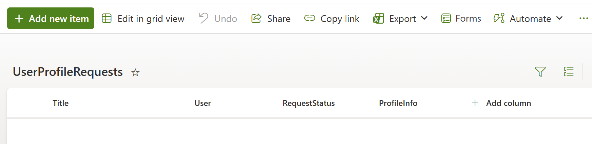

3. **Create a Azure Automation Account**: Create an Azure Automation Account to host and run the PowerShell script.
    - In the Azure portal, [navigate to Resource groups](https://portal.azure.com/#browse/resourcegroups) and create a new resource group (e.g., "rg-automation-workshop").
      
    **WARNING** again if you are doing this on your production tenant, make sure to create it in a safe manner.
    - Navigate to the newly created resource group.
    - In the resource group, create a new Automation Account.
    
    - Name the Automation Account (e.g., "aa-automation-workshop"), select the appropriate region, and create it with the rest of the settings as default.
    
    - In the Automation Account, navigate to "Runtime Environments" and create a new PowerShell 7.4 runtime environment (e.g., "GraphPowerShell"). Make sure to add the necessary modules: Microsoft.Graph.Authentication, Microsoft.Graph.Users.

4. Configure the Automation Account managed identity to add permissions to call Microsoft Graph API. There is no way to do this in the portal, it must be done with a script
    - In the Automation Account, navigate to the "Identity" section and enable the System Assigned managed identity.
    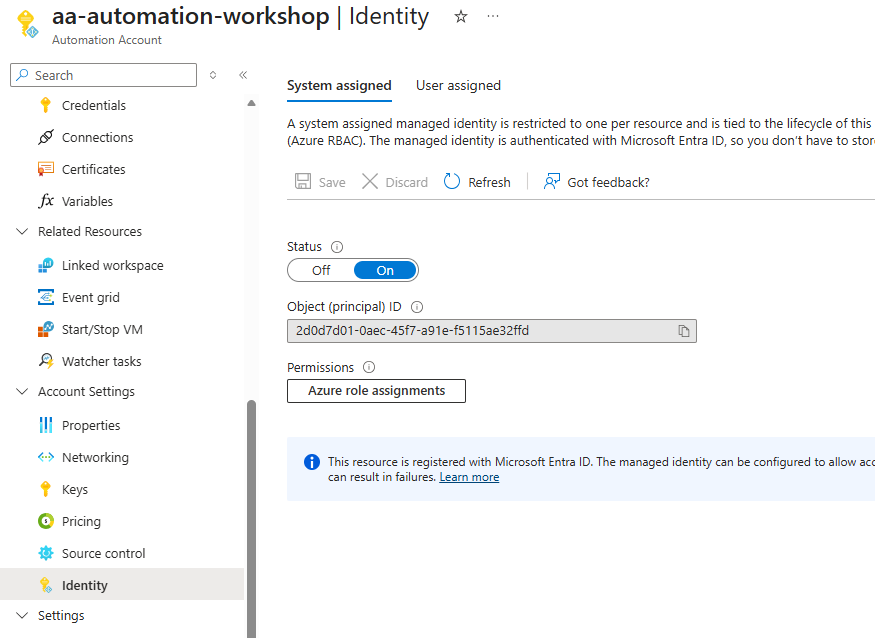
    - Copy the Object ID of the managed identity, you will need it in the next step.
    - Clone this repository to your local machine and open it in code.
    ```powershell
    cd <your-working-directory>
    git clone https://github.com/JoelQuimper/presentations-and-labs.git
    cd presentations-and-labs
    code .
    ```
    - Find the "Set-AutomationAccountPermissions.ps1" file and open it.
    - Replace the first line with the Object ID of the managed identity copied earlier.
    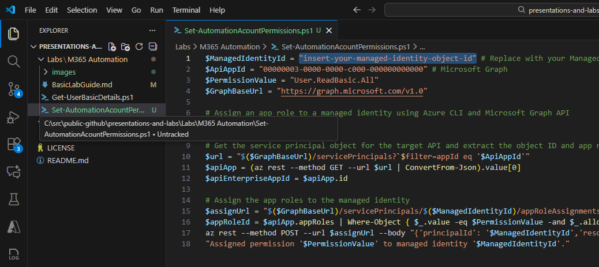
    - Open a PowerShell terminal in Visual Studio Code.
    - Run the script to assign the necessary permissions to the managed identity.
    ```powershell
    cd Labs\M365-Automation
    .\Set-AutomationAccountPermissions.ps1
    ```    
5. **Create a Runbook in your Azure Automation Account**: Create an Azure Automation Runbook to host the PowerShell script that will process user profile requests.
    - Navigate to the Automation Account created earlier.
    - Navigate to Runbooks and create a new Runbook. Call it "ProcessUserProfileRequests".  Make sure to select the runtime environment created earlier.
    
    - When the runbook editor opens, replace the default code with the content of the PowerShell script called Get-UserBasicDetails.ps1.
    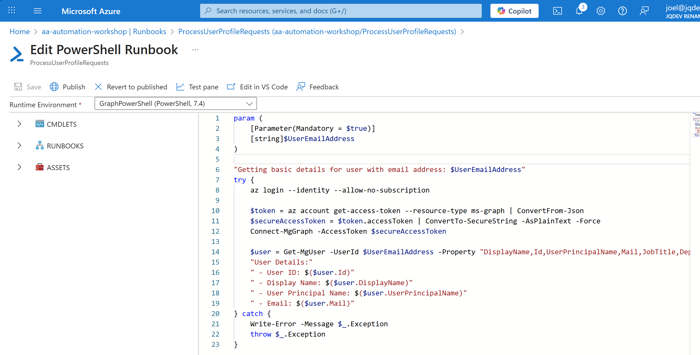
    - Save and publish the Runbook.
    - Test the Runbook to ensure it works as expected by clicking the "Start" button in the Runbook overview page.  Give a valid email address in the UserEmailAddress parameter.
    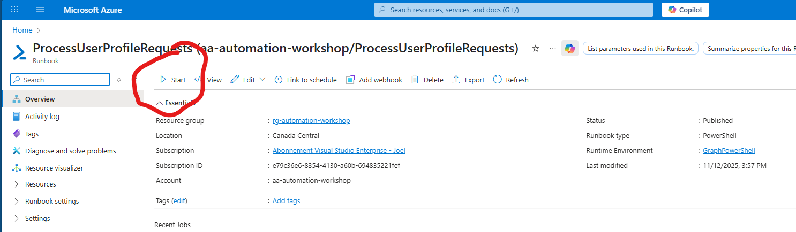
    - You should see the output in the job details page.
    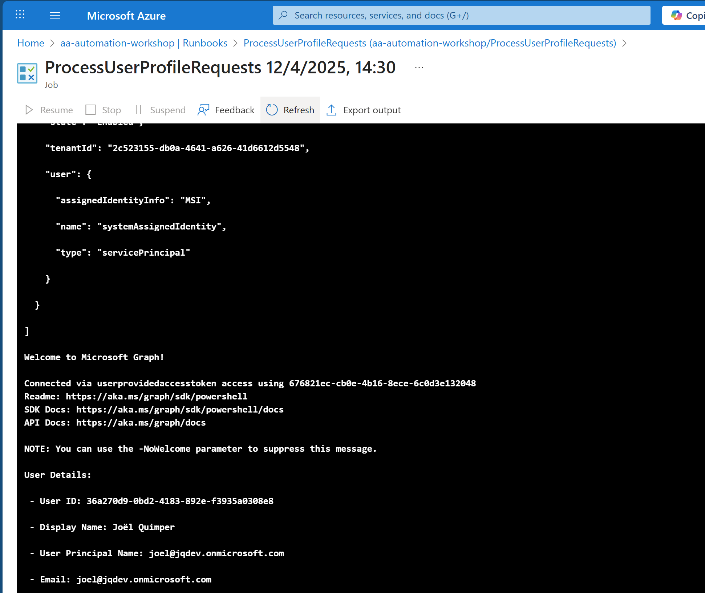

6. **Create a LogicApp** : Create a Logic App to trigger the PowerShell script when a new item is added to the SharePoint list.
    - Open a new browser tab.
    - In the Azure portal, navigate to the resource group created earlier.
    - Create a new Logic App.
    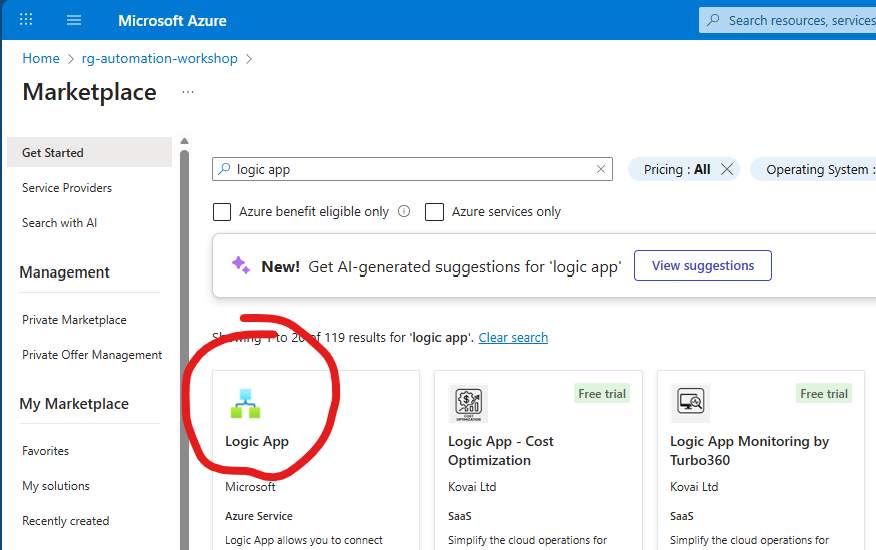
    - Choose the "Consumption" plan.
    - Name the Logic App (e.g., "logic-user-profile-listener-jq"). The reason I normally add my initials (jq) is to avoid name conflicts. You could put anything you want here as long as it is unique.
    
    - Enable the Logic App identity under the "Identity" section.
    
    - Switch to the Automation Account browser tab. Navigate to the "Access control (IAM)" section and assign the "Automation Job Operator" and "Automation Operator" roles to the Logic App identity.
    
    - Switch back to the Logic App browser tab. Open the Logic App designer.
    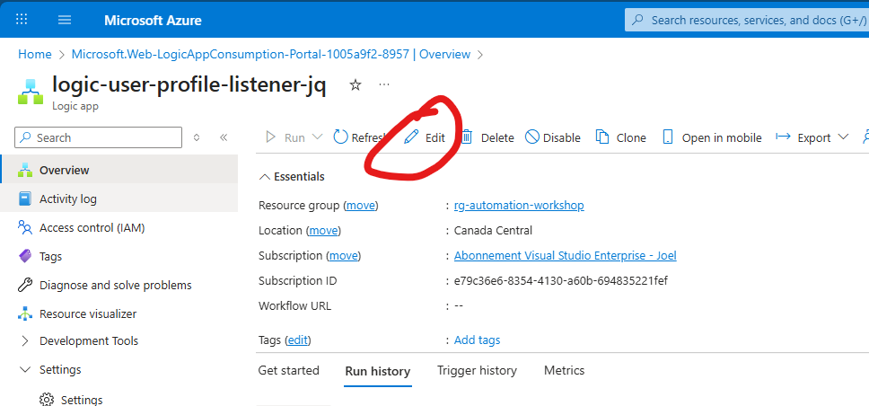
    - In the Logic App designer, set up a trigger for "When an item is created" in SharePoint.
    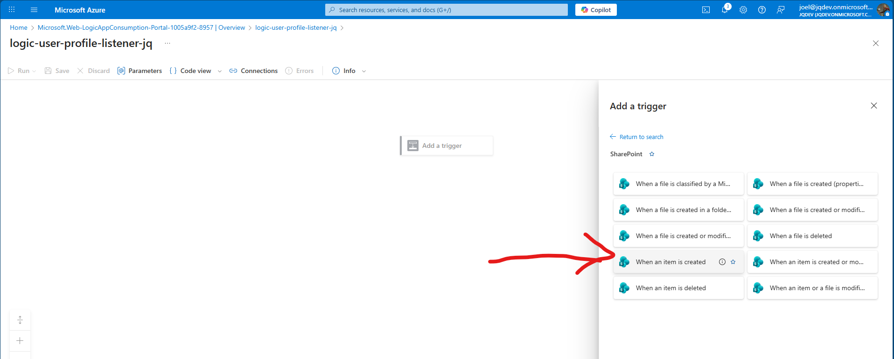
    - Make sure the user you use to connect the SharePoint Connector has access to the SharePoint site.
    
    - Add an action to start the "ProcessUserProfileRequests" Runbook in the Automation Account. You will need to enter the Subscription, Resource Group manually. The other fields should populate automatically.  This is because the Logic App have access to the Automation Account but not to the parent resources.
    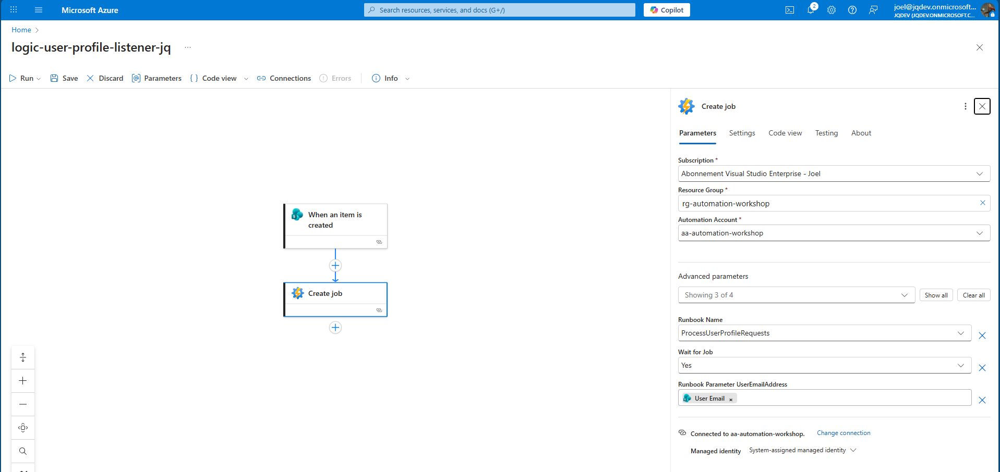
    - Add another task to retrieve the job output after the Runbook execution.
    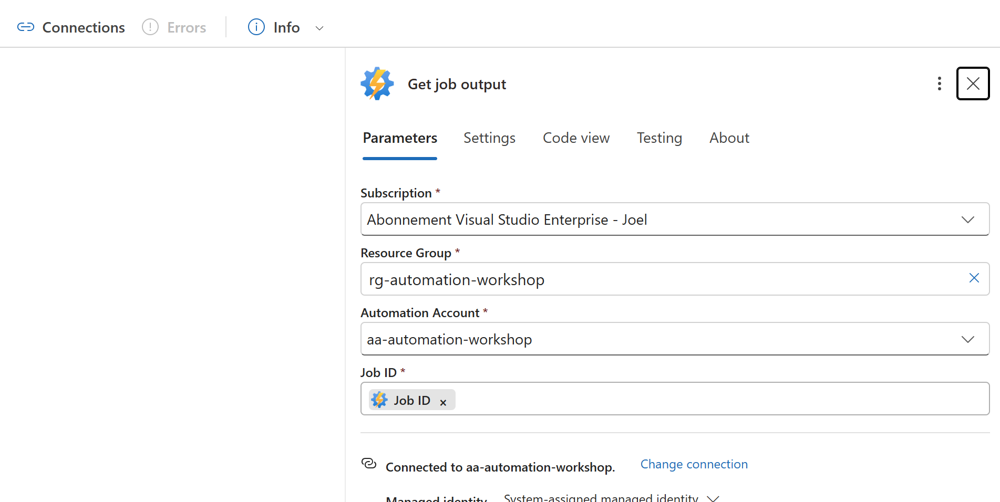
    - Add an "Update item" task and map the ProfileInfo and RequestStatus parameters for the SharePoint item.
    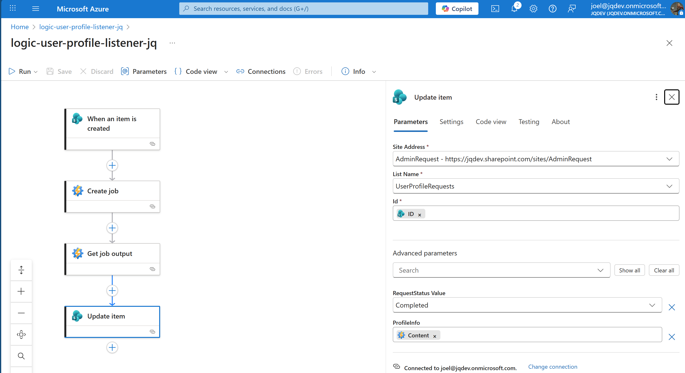

7. **Testing the Lab**: Test the entire setup by adding a new item to the SharePoint list. The Logic App should trigger in the following minutes, if you want to accelerate the process you can manually trigger the Logic App. The PowerShell script should run and update the SharePoint list item with the user's profile information from Entra.
